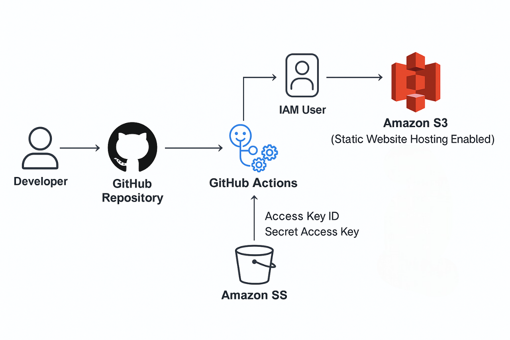
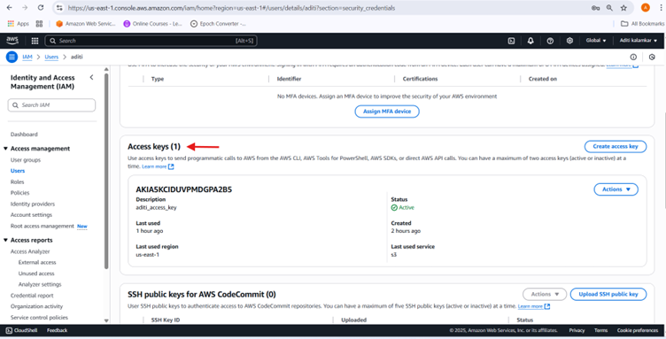

# 🚀 Static Website Deployment using GitHub Actions

## 🔧 Project Overview

**Objective:**  
Design, deploy, and automate the deployment of a static e-commerce website using HTML, CSS, JavaScript, AWS S3, IAM, and GitHub Actions.

**Technologies Used:**

- HTML, CSS, JavaScript  
- AWS S3  
- AWS IAM  
- GitHub & GitHub Actions

---

## 🏗️ Architecture Diagram

The following diagram illustrates the CI/CD workflow for deploying the static website using GitHub Actions and AWS S3.

**Workflow Steps:**
1. **Developer pushes code** to the GitHub repository.
2. **GitHub Actions** detects the push and triggers the workflow.
3. The workflow **checks out the code** and **configures AWS credentials** using secrets.
4. The workflow **syncs website files** to the AWS S3 bucket.
5. **AWS S3** hosts the static website and serves it to users via the public endpoint.




This automated pipeline ensures that every code change is deployed seamlessly to your live static website.

---

## 1. Website Development

### Step 1: Design Static Website
Create HTML, CSS, and JavaScript files for the e-commerce website.  


---

## 2. GitHub Repository Setup

### Step 2: Create GitHub Repository  
Create a new repository on GitHub.

**Repository URL:**  
[https://github.com/aditikalamkar/E-Commerce-githubActions.git](https://github.com/aditikalamkar/E-Commerce-githubActions.git)


---

## 3. AWS S3 Setup for Static Hosting

### Step 3: Create S3 Bucket
- Go to AWS S3 and create a new bucket.  
- Uncheck **"Block all public access"**.  
- Enable **"Static Website Hosting"**.


### Step 4: Upload Website Files  
Upload HTML, CSS, and JavaScript files to the S3 bucket.


### Step 5: Test Website  
- Go to **Properties** → **Static website hosting**  
- Copy the **endpoint URL** and paste it in your browser.


---

## 4. IAM Configuration for CI/CD Access

### Step 6: Create IAM User/Role
- Create IAM user or role with **programmatic access**.
- Assign the **AmazonS3FullAccess** or a custom policy.


### Step 7: Generate Access & Secret Key  
Save the **Access Key ID** and **Secret Access Key** securely.



---

## 5. GitHub Actions CI/CD Setup

### Step 8: Store IAM Credentials in GitHub Secrets
Navigate to:  
**GitHub Repo → Settings → Secrets → Actions → Add:**
- `AWS_ACCESS_KEY_ID`  
- `AWS_SECRET_ACCESS_KEY`


### Step 9: Add GitHub Actions Workflow
Add a workflow file at `.github/workflows/main.yml` to automate deployment to S3.

```yaml
name: Deploy to S3

on:
  push:
    branches:
      - main

jobs:
  deploy:
    runs-on: ubuntu-latest
    steps:
      - name: Checkout code
        uses: actions/checkout@v3

      - name: Configure AWS credentials
        uses: aws-actions/configure-aws-credentials@v2
        with:
          aws-access-key-id: ${{ secrets.AWS_ACCESS_KEY_ID }}
          aws-secret-access-key: ${{ secrets.AWS_SECRET_ACCESS_KEY }}
          aws-region: us-east-1

      - name: Sync to S3
        run: aws s3 sync . s3://your-bucket-name --delete
```

---

## 6. Test CI/CD Workflow

### Step 10: Push Code and Verify Deployment
- Make changes → push to main branch  
- GitHub Actions triggers the workflow  
- Your code syncs with the S3 bucket


---

## ✅ Final Result
Your static website is live and automatically updated with every push to `main`.


